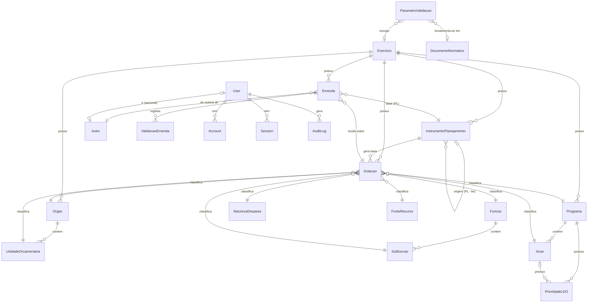

# Emendas Parlamentares

Sistema de Gestão de Emendas Parlamentares para o orçamento público municipal
brasileiro (PPA / LDO / LOA). Interface separada por **Poder** (Legislativo ×
Executivo), com base estruturada de dotações gerada a partir dos instrumentos de
planejamento e apresentação de emendas **sem digitação livre** de classificação
orçamentária.

## Stack

- **Next.js 16** (App Router) + **React 19** + **TypeScript**
- **PostgreSQL** (Neon) + **Prisma 7** (driver adapter `@prisma/adapter-pg`)
- **Auth.js** (next-auth v5) — autenticação e autorização por Poder/Role
- **Tailwind CSS v4** + **shadcn/ui**
- Deploy em **Vercel**, CI no **GitHub Actions**

## Papéis e Poderes

**Executivo** — elabora/envia instrumentos de planejamento, sobe leis aprovadas,
acompanha execução: `EXEC_ADMIN`, `EXEC_PLANEJAMENTO`, `EXEC_CONSULTA`.

**Legislativo** — apresenta e tramita emendas sobre a base disponibilizada:
`LEG_ADMIN`, `LEG_TECNICO`, `LEG_AUTOR`, `LEG_CONSULTA`.

**Transversal** — `SUPER_ADMIN` (configura sistema, parâmetros, usuários e
repositório normativo).

Fluxo institucional: Executivo sobe o PL do PPA/LDO/LOA → o sistema gera a base
estruturada de dotações → o Legislativo apresenta emendas sobre essa base → após
sanção, o Executivo sobe a lei aprovada → todos acompanham.

## Setup local

Pré-requisitos: Node.js LTS, um projeto no **Neon** com as connection strings
(pooled + direct) e o `gh` CLI autenticado.

```bash
npm install
cp .env.example .env          # preencher DATABASE_URL, DIRECT_URL, AUTH_SECRET
npx auth secret               # gera AUTH_SECRET (opcional)
npx prisma generate           # gera o Prisma Client em src/generated/prisma
npx prisma migrate dev        # aplica as migrations (requer .env preenchido)
npm run dev                   # http://localhost:3000
```

## Modelo de conexão (Prisma 7)

Prisma 7 usa **driver adapters**; não lê `DATABASE_URL` implicitamente.

- **Runtime** (`src/lib/prisma.ts`) → `@prisma/adapter-pg` com `DATABASE_URL`
  (conexão **pooled** do Neon).
- **Migrations / CLI** (`prisma.config.ts`) → `DIRECT_URL` (conexão **direta**,
  não-pooled — correta para DDL).

## Modelo de dados (Prisma)

Regra central: **nenhuma classificação orçamentária é texto livre** — programa,
ação, órgão, unidade, natureza e fonte são sempre FK. A `Emenda` referencia uma
`Dotacao` existente, vinculada ao `InstrumentoPlanejamento` (PROJETO_LEI) base do
exercício. O ciclo de acompanhamento liga a LEI_APROVADA ao PROJETO_LEI de origem.



**Poderes no modelo:** `User.poder` + `User.role` controlam o acesso. O Executivo
sobe `InstrumentoPlanejamento` e gera `Dotacao`; o Legislativo apresenta `Emenda`
sobre essa base; a `ValidacaoEmenda` guarda o resultado do motor (PROMPT 5).

## Variáveis de ambiente

Ver `.env.example`. Nunca versione o `.env` real.

| Variável        | Uso                                                |
| --------------- | -------------------------------------------------- |
| `DATABASE_URL`  | Postgres pooled — runtime da aplicação             |
| `DIRECT_URL`    | Postgres direto — migrations (Prisma CLI)          |
| `AUTH_SECRET`   | Segredo do Auth.js (`npx auth secret`)             |
| `AUTH_URL`      | URL base da aplicação                              |

## Scripts

```bash
npm run dev      # servidor de desenvolvimento
npm run build    # build de produção
npm run start    # servidor de produção
npm run lint     # ESLint
```
